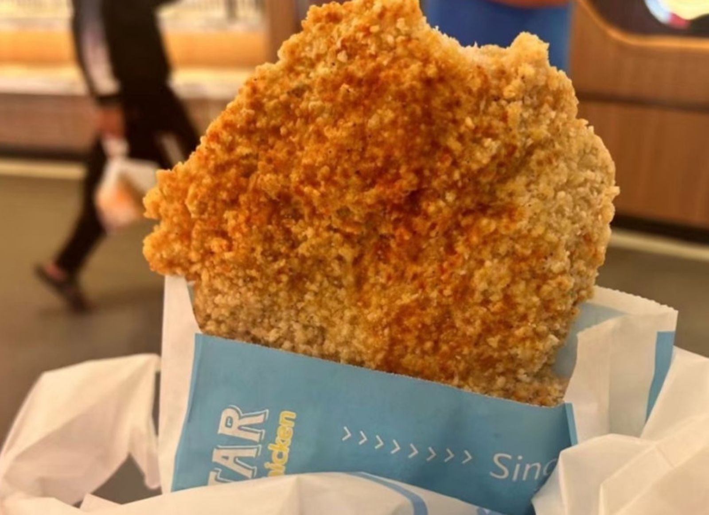

# 圖片上傳指南

## 需要的圖片

### 1. Hero 背景圖（首頁大圖）
- **位置**：`index.html` 第 136 行
- **尺寸建議**：1920x1080 或更大
- **格式**：JPG 或 PNG
- **內容**：士林夜市的夜景照片

**目前使用**：Placeholder
```html

    <span class="text-8xl">🍗</span>
</div>
```

**替換為圖片**：
```html
<div class="h-48 overflow-hidden">
    
</div>
```

## 使用 GitHub 託管圖片（推薦）

如果你的網站部署在 GitHub Pages，可以直接將圖片放在倉庫中：

1. 創建 `images` 資料夾
2. 上傳圖片到 `images/` 資料夾
3. 在 HTML 中使用相對路徑：
   ```html
   
   ```

## 使用外部圖床（備選）

如果不想放在 GitHub：
- [Imgur](https://imgur.com/) - 免費圖片託管
- [ImgBB](https://imgbb.com/) - 永久免費
- [Cloudinary](https://cloudinary.com/) - 專業圖片管理

上傳後複製圖片 URL，替換到 HTML 中。

## 推薦的圖片來源

### 免費高品質圖片
- [Unsplash](https://unsplash.com/s/photos/night-market)
- [Pexels](https://www.pexels.com/search/night%20market/)
- [Pixabay](https://pixabay.com/images/search/night%20market/)

### 士林夜市照片
- Google 搜尋「士林夜市 高清」
- 維基百科（確認授權）
- 自己拍攝（最佳選擇！）

## 圖片優化建議

上傳前建議壓縮圖片以加快載入速度：
- 使用 [TinyPNG](https://tinypng.com/) 壓縮
- Hero 背景建議 < 500KB
- 美食圖片建議 < 200KB

## 快速替換範例

如果你已經有圖片了，只需要：

```bash
# 1. 創建資料夾
mkdir images

# 2. 複製圖片（Windows）
copy your-photo.jpg images\hero-bg.jpg

# 3. 修改 index.html
# 將第 136 行的 src 改為：
src="./images/hero-bg.jpg"
```

完成！推送到 GitHub 後圖片就會顯示了。


